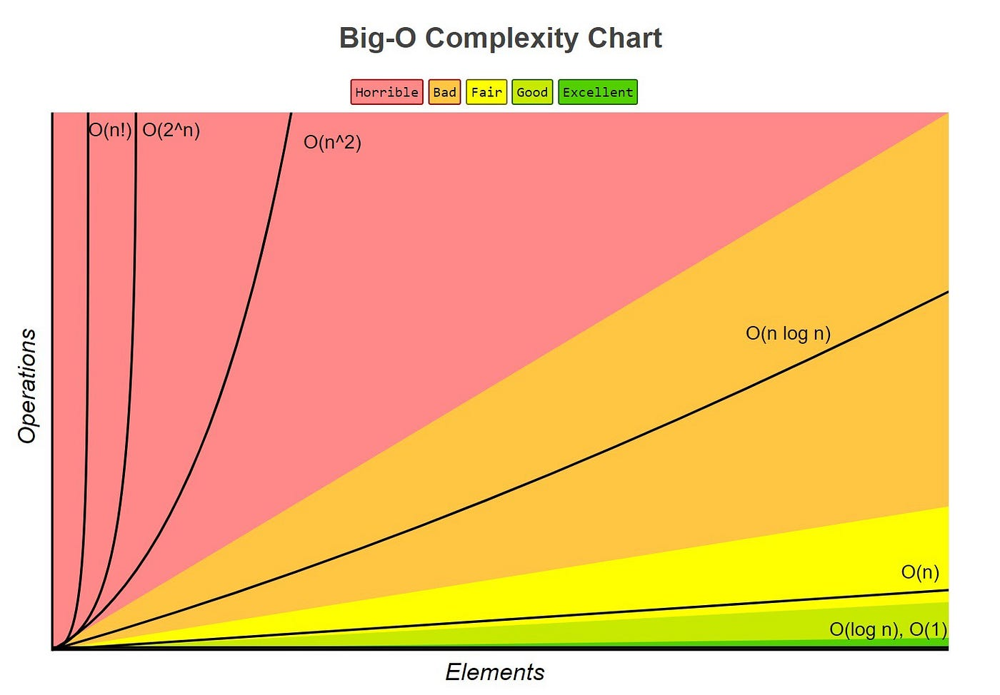
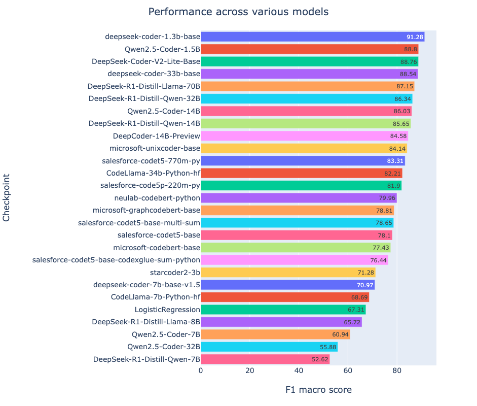

# biggitybiggityO - End-to-end implementation of code big(O) time complexity classifier
<p align="center">
  
</p>
<p align="center">
  
</p>
Big O notation is a mathematical notation that describes the limiting behavior of a function when the argument tends towards a particular value or infinity. <br>
Or in simple terms, Big O is a **way to measure algorithm's performance**.


<p align="center">
  
</p>

## What is this repository
This repository is an end-to-end implementation of code big O time complexity classifier. 
<br>At first, the data was collected, which consists of both, pre-collected data, such as [CodeComplex](https://arxiv.org/abs/2401.08719), as well as scraped data from other sources (listed below).

Then, multiple pretrained models were run through a quick evaluation to figure out which models would be the best candidates for our task in terms of performance and size.

<p align="center">
  
</p>

Then, the candidates were further evaluated which led to 1 model we chose to go with for finetuning.

The model I picked for finetuning was a model from deepseek-ai - deepseek-coder-1.3b-base for its high performance, and relatively small size.

For finetuning I used [QLoRA](https://arxiv.org/abs/2305.14314).

Before final finetuning hyperparameter search was performed to find the optimal values for hyperparameters, which maximize the F1-macro score.

Note: currently supported classes are: O(1), O(logn), O(n), O(nlogn), O(n^2), O(n^3), np

For the rest of the classes I couldn't find enough data for the system to achieve solid performance.

## Project Outcomes
By the end of this project, the following were achieved:
- Research on the topic was performed, e.g. arxiv papers;
- Data was collected
- Search of additional data sources was performed and identified
- Additional data was scraped
- Datasets were cleaned, preprocessed and merged
- Experiment tracking was set up
- Model selection was performed
- Hyperparameter search was carried out
- Finetuning was executed
- Testing was implemented
- CI pipeline was created
- API serving was implemented
- Frontend for the web app was built
- Dockerfile was created

<p align="center">
  
</p>

## 🔑 Features  
- 📥 **Scraping data** – automated collection of data  
- 🧹 **Data Cleaning & Preprocessing** – ready-to-use datasets for research & analysis  
- 📂 **Organized Dataset Storage** – structured for smooth EDA workflows  
- 📈 **Finetuning** – QLoRA finetuning
- 🎤 **API serving** – serving inference endpoint as an API 
- **Frontend** - front end for the web app.
- **Dockerfile** - ready-to-use for quickstart dockerfile.

## 📡 Data Sources  
- [CodeComplex](https://arxiv.org/abs/2401.08719)  
- [Neetcode leetcode solutions](https://neetcode.io/practice/practice/allNC) 
- [Leetcode solutions github repo](https://github.com/kamyu104/LeetCode-Solutions)

## Installation
Clone the repo and set up the environment:  

```bash
# 1. Make sure you run this on a machine that has a Nvidia GPU and nvidia drivers installed and running
nvidia-smi

# 2. Clone the repository
git clone https://github.com/komaksym/biggitybiggityO.git

# 3. Enter into the repository
cd biggitybiggityO

# 4. Build a docker image
docker build -t biggitybiggityo .

# 5. Run the docker image in a new container
docker run --gpus all -p 8000:8000

# 6. Access the web app
Go to http://localhost:8000 in your browser
```

## 📂 Directory Structure  

```bash
biggitybiggityO/
├── app                                      # App itself (API serving and frontend)
│   └── templates                            # Frontend templates
├── data                                     # Everything related to datasets
│   ├── data                                 # Data itself
│   │   ├── codecomplex                      # Data from CodeComplex
│   │   ├── leetcode-parsed                  # Scraped leetcode solutions from github repo
│   │   ├── merges                           # Merges of all of the data sources (except synthetic data)
│   │   ├── neetcode-scraped                 # Scraped leetcode solutions from leetcode
│   │   └── synthetic_data                   # Synthetic data
│   ├── data_experiment                      # Experiment to evaluate performance with synthetic data
│   │   ├── oversampling                     # Oversampling underrepresented classes
│   │   ├── train-mixed_eval-mixed           # Where eval set is a mix of real data and synthetic data
│   │   └── train-synthetic_eval-real        # Where eval set is only real data
│   └── preprocessing_scripts                # Data preprocessing code
│       ├── notebooks                        # Data preprocessing notebooks
│       └── scripts                          # Data preprocessing scripts
├── experiments                              # MLFlow-tracked experiments
├── hyperparameter-search                    # Hyperparameter search results
├── images                                   # Images for README
├── src                                      # Source code
│   ├── eval_competitors                     # Code for evaluating performance of frontier models on test set
│   ├── scraping                             # Code for scraping additional data
│   │   ├── leetcode_solutions               # Scraping from leetcode solutions (github repo)
│   │   └── neetcode                         # Scraping from leetcode solutions (neetcode)
│   └── training                             # Training code
│       ├── code                             # Training source code
│       └── tuned_model_results              # Trained model results for initial model selection
└── tests                                    # Tests
    ├── scraping                             # Scraping tests
    │   └── leetcode                         # Testing leetcode scraping code
    └── training                             # Testing training code
        ├── code                             # Testing training code itself
        └── data                             # Testing data
```

## 🤝 Contributing  

Contributions are welcome!  

- Open an **Issue** to report bugs or request features  
- Submit a **Pull Request (PR)** for improvements 

## ⭐ Why This Project Matters  

This project provides one of the **most complete python code complexity datasets** available — combining multiple sources. It opens the door for:  

- Exploratory Data Analysis on the relationship of code to time complexity
- Machine learning model building 
- Research

👉 If you find this project useful, don’t forget to **⭐ star this repository** to support its growth!  
