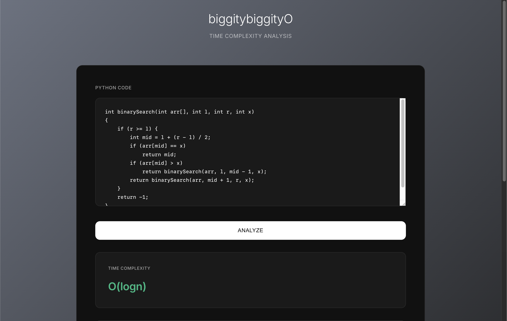
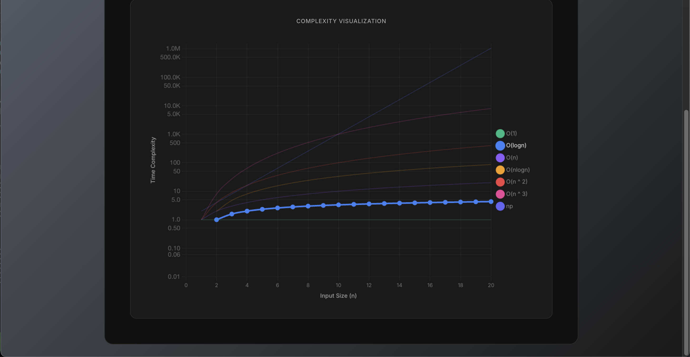
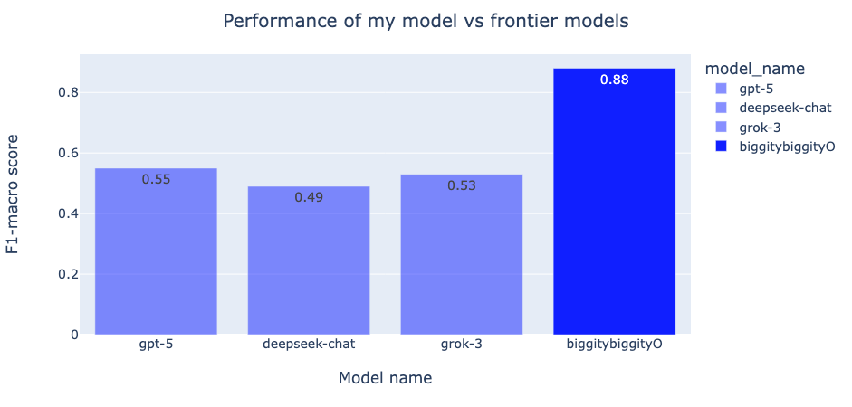

# 🚀 biggitybiggityO — End-to-End Big-O Time Complexity Classifier
<p align="center">
  
</p>
<p align="center">
  
</p>


## 📘 Overview
This repository delivers a complete pipeline for building a **code time-complexity classifier**:

- Collection of real + synthetic complexity-labeled code
- Additional scraping from LeetCode & NeetCode
- Preprocessing, cleaning, merging, and organization of datasets
- Evaluation of multiple pretrained coding models
- Hyperparameter search and QLoRA finetuning
- Model testing & experiment tracking
- REST API + web UI for real-time predictions
- Reproducible environment via Docker

The final model is built on **deepseek-coder-1.3b-base** for its strong performance-to-size ratio.

 <p align="center">
  
</p>

## 🎯 Supported Complexity Classes

- `O(1)`
- `O(log n)`
- `O(n)`
- `O(n log n)`
- `O(n^2)`
- `O(n^3)`
- `np` (non-polynomial / not predictable)

> Additional classes were excluded due to insufficient high-quality training samples.

## 🏆 Project Outcomes

By the end of this project, the following components were implemented:

- Literature research on complexity-prediction models  
- Multi-source dataset creation (real, scraped, synthetic)  
- Preprocessing pipelines & dataset merging  
- Model selection with structured evaluations  
- Hyperparameter search targeting **F1-macro**  
- QLoRA finetuning and testing  
- MLflow experiment tracking  
- REST API serving  
- Frontend UI  
- Full CI pipeline  
- Dockerized deployment

## 🔧 Features

- 📥 **Automated data scraping**  
- 🧹 **Cleaning & preprocessing pipelines**  
- 📊 **Experiment tracking with MLflow**  
- 🧠 **QLoRA-powered finetuning**  
- 📝 **Time complexity classification API**  
- 🌐 **Frontend for real-time predictions**  
- 🐳 **Dockerfile for fast deployment**

## 📡 Data Sources  
- [CodeComplex](https://arxiv.org/abs/2401.08719)  
- [Neetcode leetcode solutions](https://neetcode.io/practice/practice/allNC) 
- [Leetcode solutions github repo](https://github.com/kamyu104/LeetCode-Solutions)

## Installation
Clone the repo and set up the environment:  

```bash
# 1. Ensure NVIDIA GPU and drivers
nvidia-smi

# 2. Clone the repository
git clone https://github.com/komaksym/biggitybiggityO.git

# 3. Enter into the repository
cd biggitybiggityO

# 4. Build a docker image
docker build -t biggitybiggityo .

# 5. Run the docker image in a new container
docker run --gpus all -p 8000:8000

# 6. Access the web app
Go to http://localhost:8000 in your browser
```

## 📂 Directory Structure  

```bash
biggitybiggityO/
├── app                                      # App itself (API serving and frontend)
│   └── templates                            # Frontend templates
├── data                                     # Everything related to datasets
│   ├── data                                 # Data itself
│   │   ├── codecomplex                      # Data from CodeComplex
│   │   ├── leetcode-parsed                  # Scraped leetcode solutions from github repo
│   │   ├── merges                           # Merges of all of the data sources (except synthetic data)
│   │   ├── neetcode-scraped                 # Scraped leetcode solutions from leetcode
│   │   └── synthetic_data                   # Synthetic data
│   ├── data_experiment                      # Experiment to evaluate performance with synthetic data
│   │   ├── oversampling                     # Oversampling underrepresented classes
│   │   ├── train-mixed_eval-mixed           # Where eval set is a mix of real data and synthetic data
│   │   └── train-synthetic_eval-real        # Where eval set is only real data
│   └── preprocessing_scripts                # Data preprocessing code
│       ├── notebooks                        # Data preprocessing notebooks
│       └── scripts                          # Data preprocessing scripts
├── experiments                              # MLFlow-tracked experiments
├── hyperparameter-search                    # Hyperparameter search results
├── images                                   # Images for README
├── src                                      # Source code
│   ├── eval_competitors                     # Code for evaluating performance of frontier models on test set
│   ├── scraping                             # Code for scraping additional data
│   │   ├── leetcode_solutions               # Scraping from leetcode solutions (github repo)
│   │   └── neetcode                         # Scraping from leetcode solutions (neetcode)
│   └── training                             # Training code
│       ├── code                             # Training source code
│       └── tuned_model_results              # Trained model results for initial model selection
└── tests                                    # Tests
    ├── scraping                             # Scraping tests
    │   └── leetcode                         # Testing leetcode scraping code
    └── training                             # Testing training code
        ├── code                             # Testing training code itself
        └── data                             # Testing data
```

## 🤝 Contributing  

Contributions are welcome!  

- Open an **Issue** to report bugs or request features  
- Submit a **Pull Request (PR)** for improvements 

## ⭐ Why This Project Matters  

This project provides one of the **most complete python code complexity datasets** available — combining multiple sources. It opens the door for:  

- Research on time-complexity prediction
- ML modeling for Big-O classification
- Exploratory analysis of algorithmic patterns
- Reproducible experimentation

👉 If you find this project useful, don’t forget to **⭐ star this repository** to support its growth!  
